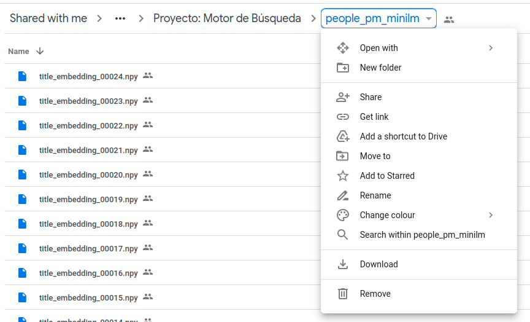

# search

Simple embedding based search on wikipedia.

# Installation

## Clone Repoy

```bash
git clone git@github.com:muelletm/search.git
cd search
```

## Environment

### Conda

```bash
conda create -n search python=3.8
conda activate search
```

### Venv

```bash
python3 -m venv $HOME/venv/search
source $HOME/venv/search/bin/activate
```

## Requirements

```bash
pip install -r requirements.txt -r dev-requirements.txt
```

## Data

```bash
mkdir -p data
```

1. Got to the [drive directory](https://drive.google.com/drive/folders/14v1rw8OHbZ8mF3WBN1dsHYLUa6JPP74G).

2. Download the data as a zip archive



3. Move and unpack

```bash
mv ~/Downloads/people_pm_minilm-*.zip .
unzip -e people_pm_minilm-*.zip
mv people_pm_minilm data/
rm people_pm_minilm-*.zip
```

## Test

```bash
dev-tools/test.sh
```